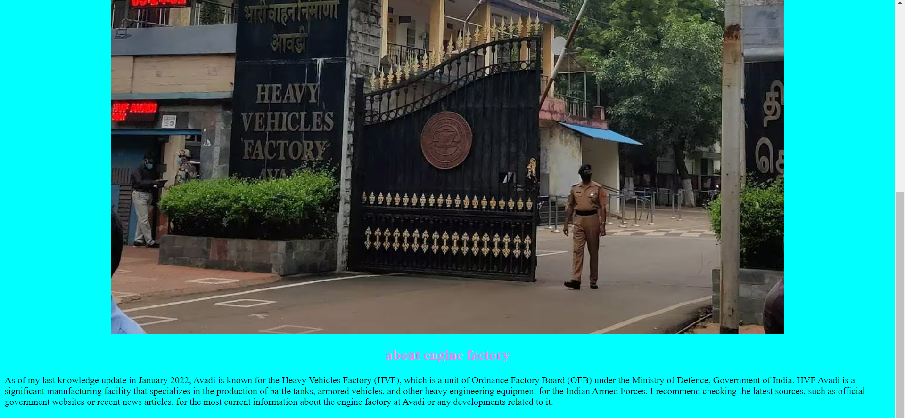
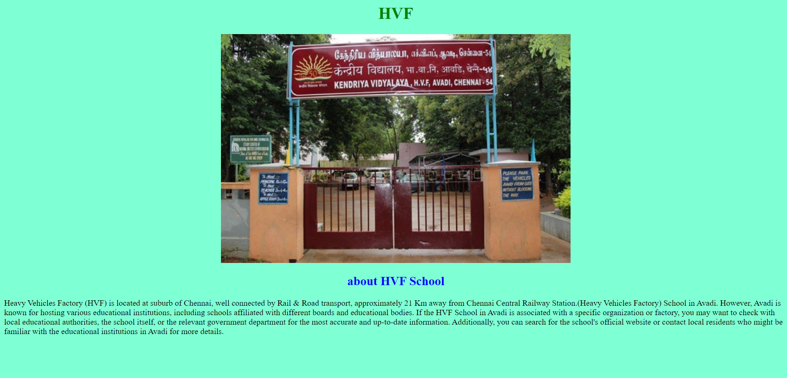
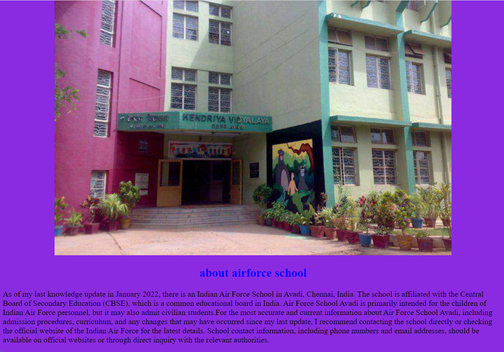
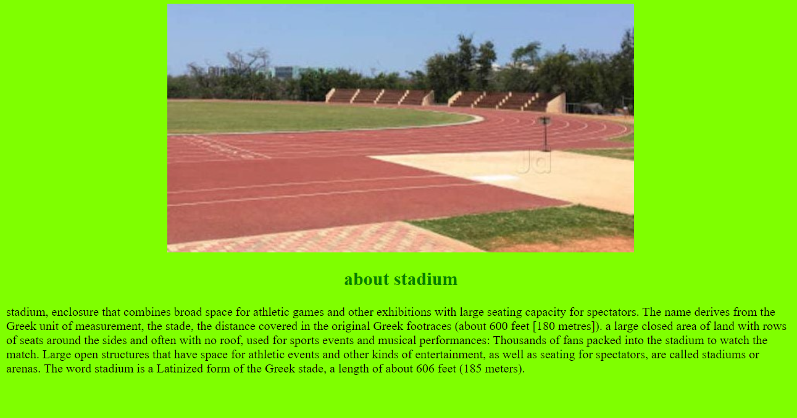

# Places Around Me
# Aim:
To develop a website to display details about the places around my house.

# Design Steps:
## Step 1
create a folder 'static' under the project folder 'mapapp'
## Step 2
In 'static', create another folder 'html',under which the file map.html should be created.

## Step 3
Go to the google map and take the screenshot of your home town on it and along with some places around it.
## step 4:
Go to images-maps.com and make five locations on it using the shapes used in maps.

## step 5:
Create a html code for the map and add it to 'map.html'.

## step 6:
Create a html documents to be displayed when click on the location map.

## step 7:
Take a screenshots of the output.

## step 8: 
Push it to 'README.md' and push it to the repositary
# Code:
```<html>
<head>
<title>My City</title>
</head>
<body>
<h1 align="center">
<fontcolor="red"><b>pattabiram</b></font>
</h1>
<h3 align="center">
<fontcolor="blue"><b>abinaya a (23002776)</b></font>
</h3>
<center>
)" usemap="#MyCity" height="610" width="1450">

<mapname="MyCity">
<area shape="rect" coords="100,100,900,900" href="home.html" title="My Home Town">
<area shape="rect" coords="463,474,620,552" href="college.html" title="jaya college">
<area shape="rect" coords="765,374,1030,445" href="factory.html" title="engine factory">
<area shape="rect" coords="743,156,900,252" href="school.html" title="air force school">
<area shape="rect" coords="1091,346,1215,394" href="stadium.html" title="stadium">
<area shape="rect" coords="675,257,789,299" href="school new.html" title="HVF School">
</map>
</center>
</body>
 </html>```


```## college.html
<html>
    <head>
        <h1 align="center"><font color="red">jaya college</font></h1>
    </head>
    <body style="background-color: brown;" >
        <h4 align="center"></h4>
        <h2 align="center"><font color="blue">about jaya college</font></h2>
        <p>
        I don't have specific information about "Jaya Arts and Science College" in Pattabiram. Institutions may change names, merge, or undergo other transformations.
        To get the most accurate and up-to-date information about Jaya Arts and Science College in Pattabiram, I recommend checking the official website of the college 
        or contacting the college directly. You can also look for recent reviews or news articles related to the college for more insights.
        </p>
    </body>
</html>```

```##factory.html
<html>
    <head>
        <h1 align="center"><font color="green">engine factory</font></h1>
    </head>
    <body style="background-color: aqua;">
        <h4 align="center"></h4>
        <h2 align="center"><font color="violet">about engine factory</font></h2>
        <p>
            As of my last knowledge update in January 2022, Avadi is known for the Heavy Vehicles Factory (HVF),
             which is a unit of Ordnance Factory Board (OFB) under the Ministry of Defence, Government of India. 
             HVF Avadi is a significant manufacturing facility that specializes in the production of battle tanks, 
             armored vehicles, and other heavy engineering equipment for the Indian Armed Forces.
            I recommend checking the latest sources, such as official government websites or recent news articles, 
            for the most current information about the engine factory at Avadi or any developments related to it.
        </p>
    </body>
</html>```

```## school.html
<html>
    <head>
        <h1 align="center"><font color="green">air force school</font></h1>
    </head>
    <body style="background-color: blueviolet;">
        <h4 align="center"></h4>
        <h2 align="center"><font color="blue">about airforce school</font></h2>
        <p>
            As of my last knowledge update in January 2022, there is an Indian Air Force School in Avadi, Chennai, India.
             The school is affiliated with the Central Board of Secondary Education (CBSE), which is a common educational board in India.
              Air Force School Avadi is primarily intended for the children of Indian Air Force personnel, 
              but it may also admit civilian students.For the most accurate and current information about Air Force School Avadi, 
              including admission procedures, curriculum, and any changes that may have occurred since my last update, 
              I recommend contacting the school directly or checking the official website of the Indian Air Force for the latest details.
               School contact information, including phone numbers and email addresses, should be available on official websites or
                through direct inquiry with the relevant authorities.    
        </p>
    </body>
</html>```

```##school.new.html
<html>
    <head>
        <h1 align="center"><font color="green">HVF</font></h1>
    </head>
    <body style="background-color: aquamarine;">
        <h4 align="center"></h4>
        <h2 align="center"><font color="blue">about HVF School</font></h2>
        <p>
        Heavy Vehicles Factory (HVF) is located at suburb of Chennai, well connected by Rail & Road transport, approximately 21 Km away
        from Chennai Central Railway Station.(Heavy Vehicles Factory) School in Avadi.
        However, Avadi is known for hosting various educational institutions, including schools affiliated with different boards and educational bodies.
        If the HVF School in Avadi is associated with a specific organization or factory, you may want to check with local educational authorities, 
        the school itself, or the relevant government department for the most accurate and up-to-date information. 
        Additionally, you can search for the school's official website or contact local residents who might be familiar with the educational 
        institutions in Avadi for more details.    
        </p>
    </body>
</html>```

```##stadium.html
<html>
    <head>
        <h1 align="center"><font color="orange"></font></h1>
    </head>
    <body style="background-color: chartreuse;">     
        <h4 align="center"></h4>
        <h2 align="center"><font color="green">about stadium </font></h2>
        <p>
            stadium, enclosure that combines broad space for athletic games and other exhibitions with large seating capacity for 
            spectators. The name derives from the Greek unit of measurement, the stade, the distance covered in the original Greek footraces 
            (about 600 feet [180 metres]). a large closed area of land with rows of seats around the sides and often with no roof, used for sports events and musical performances:
             Thousands of fans packed into the stadium to watch the match.
             Large open structures that have space for athletic events and other kinds of entertainment, as well as seating for spectators, 
             are called stadiums or arenas.
              The word stadium is a Latinized form of the Greek stade, a length of about 606 feet (185 meters).
        </p>
    </body>
</html>
```

# Output:





# Result:
the image map code is successfully created
